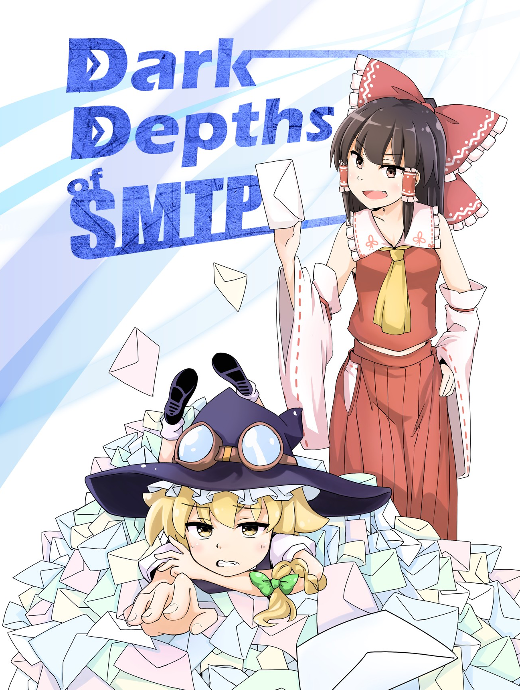

# Email, Messaging, and Self-Sovereign Identity
## Ryo Kajiwara @ WIDE Meeting, 2021/05/28

----

# 注意事項

- これはどちらかというと意見表明のような性質の発表です
  - 一時期のQiitaでいうところの「ポエム」
  - よって、**プロダクトや開発成果のデモではありません**
  - また、**議論や前提に抜けや穴は余裕で存在するハズです**

----

# スライド(のソース)は以下のURLから見れます

## `https://github.com/sylph01/20210528-wide-email-talk`

----

# <!--fit--> TL;DR

----

# <!--fit--> SMTPを**やめろ**

----

# <!--fit--> **どうやって**やめる？

----

# 遅れましたが自己紹介

- 梶原 龍 といいます
  - Twitter: `@s01`
  - 暗号とかできます
  - ネットワークまるでわからん

----

# もうちょっと真面目に

- やせいのプログラマ
  - 2019/3までの所属はACCESS、2020/10までの所属はレピダム
  - 大学時代はユーザーインターフェースとかやってたらしい
- "Dark Depths of SMTP"(2017)という薄い本を書きました
- W3C, IETFなどでセキュリティ周りの標準化の調査・お手伝いをしていました
  - HTTPS in Local Network CG @ W3C
  - Messaging Layer Security @ IETF
- Internet Society日本支部のOfficerをやっています

----

----

# 第1部: なんでSMTPをやめる？

----

# メッセージングに求める性質

- End-to-End暗号化
  - 派生して、暗号化されたグループメッセージング
- マルチデバイスのアクセス
- アイデンティティ表現の制御
  - 場面によって使うIDを変えたい

----

# Eメールはどこまでできる？

- End-to-End暗号化 -> **S/MIMEを使えば**1対1なら可能
- 暗号化されたグループメッセージング -> **不可能**
- マルチデバイスのアクセス -> POP3なら不可能、IMAPなら可能
  - ただし、IMAPの場合データがサーバーに残ることが前提
- アイデンティティ表現の制御
  - メールアドレスを複数所持すれば可能
  - 受信アドレスを出し分けるのはローカルパート `+` suffixを使えば可能だが関連付けは容易

----

# Q: なんで **LINE/Facebook Messenger/WhatsApp etc.** があるのにメールなんか使ってるの？

----

# Q: なんでLINE/Facebook Messenger/WhatsApp etc.があるのにメールなんか使ってるの？

- SMTPは十分な暗号化や認証を持っていない → **insecure**
  - Eメールは通常End-to-End暗号化を持っていない
  - そもそもSMTPの認証は拡張仕様
    - POP before SMTP, SMTP-AUTH, ...
  - PGPやS/MIMEを使ったところでグループに対する暗号化コミュニケーションはできない
- **Eメールにはspamがある**

----

# A: Eメールでは **事前の信頼関係のない人からも** メッセージを受け取ることができる

----

# でもEメールには **spamがある** じゃん！

----

# Eメールにspamがあるのはプロトコルに埋め込まれた **匿名性** が原因

----

# Eメールの匿名性

「事前の信頼関係のない人からもメッセージを受け取れる」という性質は**電話**にもあてはまるが、Eメールには電話網にあるようなanti-abuse mechanismを持っていない。これはEメールのプロトコルに埋め込まれた**匿名性**が原因である。

- 電話網をabuseした場合逆探知が可能
- Eメールにおいてはidentityのspoofingが容易で、捕まえることが困難

----

# Eメールには **identity layerがない**

----

# まともなidentity layerがないので
# **まともなtrustが構築できない**

----

# なのでspammerはこの **trustの不在を悪用する**

----

# そもそも匿名のEメール、欲しい？

匿名のEメールは高確率でspam。

新たに信頼関係を結びたい場合匿名であることにいいことはそんなにない。

----

# じゃあ全面的にS/MIME、使う？

----

# S/MIMEの問題

- 高い
- 発行された用途に縛られる
  - ある証明書は特定のorganizationの所属を証明してくれるかもしれないが
  - インターネットで常にその特定の帽子をかぶっていたいかというとそうではない
  - 複数の証明書を使えばいいじゃん？1行目に戻る

----

# もっとドラスティックな解法:

# **マイナンバーカード** の証明書でsignされたメールなら自動で受け入れる

----

# 誰も **マイナンバーに紐付いたアカウント** でspamなんかしないでしょ？

----

# まあこんなの **怖いに決まってる** じゃないですか

----

# じゃあ暗号化諦める？

----

# もともとEメールの暗号化は不十分

- S/MIMEでも使わない限りend-to-end encryptedでない
- TLSを使っているのはあくまでSMTPリレーのホップ間
  - SMTPサーバに悪意があったら平文に戻すことができます
    - ヘッダに伝送のための情報が書いてあったり、途中経路でヘッダに書き加える必要があるから仕方ないのだけど…

----

# Eメールがdigital identityの核となることの問題

- Eメールは暗号化が不十分
- パスワードを忘れたときのリセットはだいたいEメールを通して行われますね？
- → Eメールが乗っ取られるとあなたのインターネット上のidentityは**全て乗っ取れます。**

secure messagingで代替できるかはさておき、**十分にセキュアでないプロトコル/エコシステムをdigital identityの核とするのは危険であり、代替を考える必要がある。**

----

# SMSを二要素認証で使ってるし、そっちなら悪用は困難なのでは？

NIST SP 800-63BではSMS（を含む公衆電話網）による二要素認証は**条件付きで**推奨となっている。

条件付き、というのは、これ以外の方式を提供せよ、リスクアセスメントをせよ、将来的に禁止するかもしれないので移行準備せよ、というもの。

非推奨ってよく言われていたのはPreview版の時点での話。

<!-- https://ken5scal.hatenablog.com/entry/2017/07/31/SMS%E3%81%AB%E3%82%88%E3%82%8B2%E8%A6%81%E7%B4%A0%E8%AA%8D%E8%A8%BC%E3%81%AF%E6%9C%AC%E5%BD%93%E3%81%AB%E9%9D%9E%E6%8E%A8%E5%A5%A8%E3%81%AA%E3%81%AE%E3%81%8B%EF%BC%9F -->
<!-- なお、emailは「特定のデバイスの所有を証明する方式ではない」ため「使用してはならない」 -->

----

----

# 第2部: セキュアメッセージング

----

# セキュアメッセージングとは？

厳密な術語として存在するかどうかは不明だが、

ここでは**End-to-End暗号化を実現して、デフォルトで提供しているメッセージングサービス**を称してセキュアメッセージングと呼ぶ。

----

# 現在までにうまくセキュアメッセージングを実装しているところ
- LINE
  - [Letter Sealing](https://scdn.line-apps.com/stf/linecorp/en/csr/line-encryption-whitepaper-ver2.0.pdf)
- Telegram
  - [MTProto](https://core.telegram.org/mtproto)
- WhatsApp, Signal
  - [Signal Protocol](https://signal.org/docs/)
- Keybase
  - [Keybase Key Exchange (KEX)](https://book.keybase.io/docs/crypto/key-exchange)

----

# 補足: 以前の発表ではFacebook MessengerもE2EEを提供しているとしていなかったっけ？

- 確かにEnd-to-End暗号化を実現する**オプションはある**
- しかし**デフォルトで有効ではなく**
- **グループチャットができない、特定デバイスからしか有効にならない**という制限がつくので除外した。

----

# プロトコル間にも差がある

[The Hacks Between Usによる、香港の国家安全法の成立に伴って出されたメッセージングの比較記事がわかりやすい。](https://medium.com/@thehacksbetweenus/%E5%9C%8B%E5%AE%89%E6%B3%95%E9%80%9A%E9%81%8E-%E5%85%A8%E6%B0%91%E5%8F%8D%E7%9B%A3%E6%8E%A7-%E5%B8%B8%E7%94%A8%E9%80%9A%E8%A8%8A%E8%BB%9F%E9%AB%94%E5%93%AA%E5%80%8B%E6%9C%80%E5%AE%89%E5%85%A8-c85b642649e1)

- Letter Sealing: グループチャットの人数制限がある（パフォーマンス上の制限と思われる）
  - 安全性検証については[ProVerifでのモデル化と検証](https://lepidum.co.jp/blog/2018-10-26/line-proverif/)が行われている
- MTProto: グループチャットをサポートしていない

----

# グループチャットの鍵共有は難しい

メッセージングで実現したい性質である

- Forward Secrecy: 長期鍵が流出しても過去のセッション鍵の安全性が失われない
  - TLSで用いられるFS(PFS)と同じ用法
- Post-Compromise Security: グループメンバーの状態が暴露されたとしても、新たに安全な鍵が導出されて以後のグループの会話の秘密性が保たれること

を同時に満たす**グループチャット**は難しい。

----

# グループチャットの鍵共有は難しい
## 2者間であればわかりやすい

Signal Protocolで用いられるDouble Ratchet方式。

暗号におけるRatchetとは、ハッシュ関数を用いて「新しい値から過去の値を計算できないように鍵を導出する」仕組みである。

$$
CK_{i+1} = \textrm{HMAC-SHA256}(CK_i, 0x02) \\
MK_{i}   = \textrm{HMAC-SHA256}(CK_i, 0x01)
$$

のように $CK_i$ からメッセージごとに異なる $MK_i$ を作り出す。

$CK_i+1$ から $CK_i$ が計算できないことに注意。

<!-- chaining keyとmessage key -->

----

# グループチャットの鍵共有は難しい

- 3者以上では自明ではない
  - sender keyをブロードキャストする方法がよく取られるがこれはFSでない
  - hash ratchetでFSは実現できるが一度破られると鍵の更新に同じ方法を使わなくてはならない
- また、マルチデバイス対応が必要な場合デバイス間で鍵を安全に共有することが困難
  - グループチャットのメンバーの一員かのように別の鍵を配ってしまうことができればよいが…

----

# セキュアメッセージングで全てが解決？

# →**No.**

----

# サービス事業者の「悪堕ち」

- LINEのデータ管理問題
  - 本体のガバナンスの問題であることに加えて…
  - 通常の通信そのものは暗号化されているが、スタンプのアクセスログは残っていてそこからどのようなスタンプが用いられたかは類推可能 → 必ずしもすべての通信が運営から保護されていたわけではない

----

# Interoperableなプロトコルが欲しい！

----

# Messaging Layer Security

----

# Messaging Layer Security

日本語の資料としては過去にしゃべったスライドがありますが、最新で2年前なのでちょっと古いことに注意が必要です

- https://speakerdeck.com/sylph01/messaging-layer-security
- https://speakerdeck.com/sylph01/messaging-layer-security-and-stuff-at-ietf105

----

# Messaging Layer Security

- メッセージの秘密性・完全性・認証
- メンバーの認証
- 非同期性（メンバーの常時オンライン性を要求しない）
- Forward Secrecy, Post-Compromise Secrecy
- スケーラビリティ

を実現する**グループ鍵共有**のinteroperableな方法の確立を目指すIETFのworking group

----

# Messaging Layer Security

- アーキテクチャを定める [draft-ietf-mls-architecture-06](https://datatracker.ietf.org/doc/draft-ietf-mls-architecture/)
- プロトコルを定める [draft-ietf-mls-protocol-11](https://datatracker.ietf.org/doc/draft-ietf-mls-protocol/)

がWG documentとして存在する。まだどちらもstatusは"I-D Exists"（進行中）。

[WGのWebサイト messaginglayersecurity.rocks がある。](https://messaginglayersecurity.rocks/)

----

----

# 第3部: Self-Sovereign Identity

----

- サービス事業者の「悪堕ち」に耐えるには？→Self-Sovereign Identity
- SSIのコンセプト
  - https://lepidum.co.jp/blog/2020-01-31/self-sovereign-identity/
- identity表現の出しわけをしたい
  - corelationを割けたい
  - pair-wise identifier
- EメールはもともとSelf-Sovereignだった
  - Eメールというプロトコルがいかに中央集権化されていったか
- Principles of User Sovereignty / Fundamental Problems of Distributed Systems @ IIW30

----

# 第4部: どうやってSMTPをやめる？

----

- Better PGPだよね？
  - 知ってる。
  - ただし我々は既にBetter PGPを手にしている
    - LINE, WhatsApp, Keybase(, FB Messenger)っていうんですけど
  - 暗号鍵の管理がしんどいはそのとおり
- グループメッセージングはチャットアプリのインターフェースに寄せて再設計していいのでは？
- 通知にsubscribeする形のmessaging(Notifs)
- DIDComm
  - ちゃんと調べて書く
- Verifiable Credentialを用いたEメール
  - VC modelの説明
- data at restの暗号化: JWM

----

# まとめ

----

- Eメールには暗号化がない、まともなidentity layerがない
- identity layerの構築をEメールプロバイダに任せるとself-sovereignでなくなる
- セキュアメッセージングのinteroperabilityが欲しい
- DIDを使ったidentity layerを作ってそれに乗っかってしまうのがいいのでは？
- a
