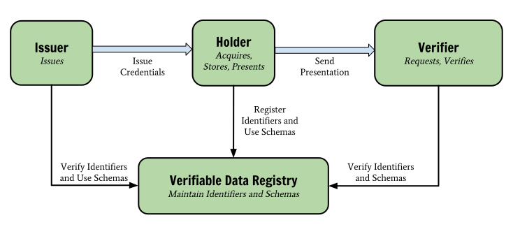

# Email, Messaging, and Self-Sovereign Identity
## Ryo Kajiwara @ WIDE Meeting, 2021/05/28

----

# 注意事項

- これはどちらかというと意見表明のような性質の発表です
  - 一時期のQiitaでいうところの「ポエム」
  - よって、**プロダクトや開発成果のデモではありません**
  - また、**議論や前提に抜けや穴は余裕で存在するハズです**

----

# スライド(のソース)は以下のURLから見れます

## `https://github.com/sylph01/20210528-wide-email-talk`

----

# English version (from 2020, so not up to date):

## `https://speakerdeck.com/sylph01/did`

----

# <!--fit--> TL;DR

----

# <!--fit--> SMTPを**やめろ**

----

# <!--fit--> **どうやって**やめる？

----

# 遅れましたが自己紹介

- 梶原 龍 といいます
  - Twitter: `@s01`
  - 暗号とかできます
  - ネットワークまるでわからん

----

# もうちょっと真面目に

- やせいのプログラマ
  - 2019/3までの所属はACCESS、2020/10までの所属はレピダム
  - 大学時代はユーザーインターフェースとかやってたらしい
- "Dark Depths of SMTP"(2017)という薄い本を書きました
- W3C, IETFなどでセキュリティ周りの標準化の調査・お手伝いをしていました
  - HTTPS in Local Network CG @ W3C
  - Messaging Layer Security @ IETF
- Internet Society日本支部のOfficerをやっています

----

----

# 第1部: なんでSMTPをやめる？

----

# メッセージングに求める性質

- End-to-End暗号化
  - 派生して、暗号化されたグループメッセージング
- マルチデバイスのアクセス
- アイデンティティ表現の制御
  - 場面によって使うIDを変えたい

----

# Eメールはどこまでできる？

- End-to-End暗号化 -> **S/MIMEを使えば**1対1なら可能
- 暗号化されたグループメッセージング -> **不可能**
- マルチデバイスのアクセス -> POP3なら不可能、IMAPなら可能
  - ただし、IMAPの場合データがサーバーに残ることが前提
- アイデンティティ表現の制御
  - メールアドレスを複数所持すれば可能
  - 受信アドレスを出し分けるのはローカルパート `+` suffixを使えば可能だが関連付けは容易

----

# Q: なんで **LINE/Facebook Messenger/WhatsApp etc.** があるのにメールなんか使ってるの？

----

# Q: なんでLINE/Facebook Messenger/WhatsApp etc.があるのにメールなんか使ってるの？

- SMTPは十分な暗号化や認証を持っていない → **insecure**
  - Eメールは通常End-to-End暗号化を持っていない
  - そもそもSMTPの認証は拡張仕様
    - POP before SMTP, SMTP-AUTH, ...
  - PGPやS/MIMEを使ったところでグループに対する暗号化コミュニケーションはできない
- **Eメールにはspamがある**

----

# A: Eメールでは **事前の信頼関係のない人からも** メッセージを受け取ることができる

----

# でもEメールには **spamがある** じゃん！

----

# Eメールにspamがあるのはプロトコルに埋め込まれた **匿名性** が原因

----

# Eメールの匿名性

「事前の信頼関係のない人からもメッセージを受け取れる」という性質は**電話**にもあてはまるが、Eメールには電話網にあるようなanti-abuse mechanismを持っていない。これはEメールのプロトコルに埋め込まれた**匿名性**が原因である。

- 電話網をabuseした場合逆探知が可能
- Eメールにおいてはidentityのspoofingが容易で、捕まえることが困難

----

# Eメールには **identity layerがない**

----

# まともなidentity layerがないので
# **まともなtrustが構築できない**

----

# なのでspammerはこの **trustの不在を悪用する**

----

# そもそも匿名のEメール、欲しい？

匿名のEメールは高確率でspam。

新たに信頼関係を結びたい場合匿名であることにいいことはそんなにない。

----

# じゃあ全面的にS/MIME、使う？

----

# S/MIMEの問題

- 高い
- 発行された用途に縛られる
  - ある証明書は特定のorganizationの所属を証明してくれるかもしれないが
  - インターネットで常にその特定の帽子をかぶっていたいかというとそうではない
  - 複数の証明書を使えばいいじゃん？1行目に戻る

----

# もっとドラスティックな解法:

# **マイナンバーカード** の証明書でsignされたメールなら自動で受け入れる

----

# 誰も **マイナンバーに紐付いたアカウント** でspamなんかしないでしょ？

----

# まあこんなの **怖いに決まってる** じゃないですか

----

# じゃあ暗号化諦める？

----

# もともとEメールの暗号化は不十分

- S/MIMEでも使わない限りend-to-end encryptedでない
- TLSを使っているのはあくまでSMTPリレーのホップ間
  - SMTPサーバに悪意があったら平文に戻すことができます
    - ヘッダに伝送のための情報が書いてあったり、途中経路でヘッダに書き加える必要があるから仕方ないのだけど…

----

# Eメールがdigital identityの核となることの問題

- Eメールは暗号化が不十分
- パスワードを忘れたときのリセットはだいたいEメールを通して行われますね？
- → Eメールが乗っ取られるとあなたのインターネット上のidentityは**全て乗っ取れます。**

secure messagingで代替できるかはさておき、**十分にセキュアでないプロトコル/エコシステムをdigital identityの核とするのは危険であり、代替を考える必要がある。**

----

# SMSを二要素認証で使ってるし、そっちなら悪用は困難なのでは？

NIST SP 800-63BではSMS（を含む公衆電話網）による二要素認証は**条件付きで**推奨となっている。

条件付き、というのは、これ以外の方式を提供せよ、リスクアセスメントをせよ、将来的に禁止するかもしれないので移行準備せよ、というもの。

非推奨ってよく言われていたのはPreview版の時点での話。

暗号化されていないので（ただ公衆電話網のピンポイントの盗聴がインターネットの盗聴に比べて難しいというだけ）どのみち大差ない。

<!-- https://ken5scal.hatenablog.com/entry/2017/07/31/SMS%E3%81%AB%E3%82%88%E3%82%8B2%E8%A6%81%E7%B4%A0%E8%AA%8D%E8%A8%BC%E3%81%AF%E6%9C%AC%E5%BD%93%E3%81%AB%E9%9D%9E%E6%8E%A8%E5%A5%A8%E3%81%AA%E3%81%AE%E3%81%8B%EF%BC%9F -->
<!-- なお、emailは「特定のデバイスの所有を証明する方式ではない」ため「使用してはならない」 -->

----

----

# 第2部: セキュアメッセージング

----

# セキュアメッセージングとは？

厳密な術語として存在するかどうかは不明だが、

ここでは**End-to-End暗号化を実現して、デフォルトで提供しているメッセージングサービス**を称してセキュアメッセージングと呼ぶ。

----

# 現在までにうまくセキュアメッセージングを実装しているところ
- LINE
  - [Letter Sealing](https://scdn.line-apps.com/stf/linecorp/en/csr/line-encryption-whitepaper-ver2.0.pdf)
- Telegram
  - [MTProto](https://core.telegram.org/mtproto)
- WhatsApp, Signal
  - [Signal Protocol](https://signal.org/docs/)
- Keybase
  - [Keybase Key Exchange (KEX)](https://book.keybase.io/docs/crypto/key-exchange)

----

# 補足: 以前の発表ではFacebook MessengerもE2EEを提供しているとしていなかったっけ？

- 確かにEnd-to-End暗号化を実現する**オプションはある**
- しかし**デフォルトで有効ではなく**
- **グループチャットができない、特定デバイスからしか有効にならない**という制限がつくので除外した。

----

# プロトコル間にも差がある

[The Hacks Between Usによる、香港の国家安全法の成立に伴って出されたメッセージングの比較記事がわかりやすい。](https://medium.com/@thehacksbetweenus/%E5%9C%8B%E5%AE%89%E6%B3%95%E9%80%9A%E9%81%8E-%E5%85%A8%E6%B0%91%E5%8F%8D%E7%9B%A3%E6%8E%A7-%E5%B8%B8%E7%94%A8%E9%80%9A%E8%A8%8A%E8%BB%9F%E9%AB%94%E5%93%AA%E5%80%8B%E6%9C%80%E5%AE%89%E5%85%A8-c85b642649e1)

- Letter Sealing: グループチャットの人数制限がある（パフォーマンス上の制限と思われる）
  - 安全性検証については[ProVerifでのモデル化と検証](https://lepidum.co.jp/blog/2018-10-26/line-proverif/)が行われている
- MTProto: グループチャットをサポートしていない

----

# グループチャットの鍵共有は難しい

メッセージングで実現したい性質である

- Forward Secrecy: 長期鍵が流出しても過去のセッション鍵の安全性が失われない
  - TLSで用いられるFS(PFS)と同じ用法
- Post-Compromise Security: グループメンバーの状態が暴露されたとしても、新たに安全な鍵が導出されて以後のグループの会話の秘密性が保たれること

を同時に満たす**グループチャット**は難しい。

----

# グループチャットの鍵共有は難しい
## 2者間であればわかりやすい

Signal Protocolで用いられるDouble Ratchet方式。

暗号におけるRatchetとは、ハッシュ関数を用いて「新しい値から過去の値を計算できないように鍵を導出する」仕組みである。

$$
CK_{i+1} = \textrm{HMAC-SHA256}(CK_i, 0x02) \\
MK_{i}   = \textrm{HMAC-SHA256}(CK_i, 0x01)
$$

のように $CK_i$ からメッセージごとに異なる $MK_i$ を作り出す。

$CK_i+1$ から $CK_i$ が計算できないことに注意。

<!-- chaining keyとmessage key -->

----

# グループチャットの鍵共有は難しい

- 3者以上では自明ではない
  - sender keyをブロードキャストする方法がよく取られるがこれはFSでない
  - hash ratchetでFSは実現できるが一度破られると鍵の更新に同じ方法を使わなくてはならない
- また、マルチデバイス対応が必要な場合デバイス間で鍵を安全に共有することが困難
  - グループチャットのメンバーの一員かのように別の鍵を配ってしまうことができればよいが…

----

# セキュアメッセージングで全てが解決？

# →**No.**

----

# サービス事業者の「悪堕ち」

- LINEのデータ管理問題
  - 本体のガバナンスの問題であることに加えて…
  - 通常の通信そのものは暗号化されているが、スタンプのアクセスログは残っていてそこからどのようなスタンプが用いられたかは類推可能 → 必ずしもすべての通信が運営から保護されていたわけではない

----

# Interoperableなプロトコルが欲しい！

----

# Messaging Layer Security

----

# Messaging Layer Security

日本語の資料としては過去にしゃべったスライドがありますが、最新で2年前なのでちょっと古いことに注意が必要です

- https://speakerdeck.com/sylph01/messaging-layer-security
- https://speakerdeck.com/sylph01/messaging-layer-security-and-stuff-at-ietf105

----

# Messaging Layer Security

- メッセージの秘密性・完全性・認証
- メンバーの認証
- 非同期性（メンバーの常時オンライン性を要求しない）
- Forward Secrecy, Post-Compromise Secrecy
- スケーラビリティ

を実現する**グループ鍵共有**のinteroperableな方法の確立を目指すIETFのworking group

----

# Messaging Layer Security

- アーキテクチャを定める [draft-ietf-mls-architecture-06](https://datatracker.ietf.org/doc/draft-ietf-mls-architecture/)
- プロトコルを定める [draft-ietf-mls-protocol-11](https://datatracker.ietf.org/doc/draft-ietf-mls-protocol/)

がWG documentとして存在する。まだどちらもstatusは"I-D Exists"（進行中）。

[WGのWebサイト messaginglayersecurity.rocks がある。](https://messaginglayersecurity.rocks/)

----

----

# 第3部: Self-Sovereign Identity

----

# Self-Sovereign Identityとは

日本語だと「自己主権型アイデンティティ」と呼ばれる。

外部のIdentity Providerに頼る中央集権化されたアイデンティティモデルに対して、自らの手にアイデンティティのコントロールを取り戻すことを目指す動き・その思想のこと。

前職のテックブログに記事を書いた。 https://lepidum.co.jp/blog/2020-01-31/self-sovereign-identity/

----

# Self-Sovereign Identityとは

- 中央集権化されたIDのリスク
  - 情報漏洩
  - 情報の目的外利用、必要以上の情報収集
  - 自らのデジタルアイデンティティへのアクセスを失う
    - 2020年以降Terms of Service違反でのアカウントBANが急に現実化した

<!-- 西洋の主流の政治的指向や倫理観に反するアカウントがBANの危機にさらされるようになった。日本人にとって最も身近なのは「絵師が児童ポルノを描いているとしてBANされる」例 -->

----

# Self-Sovereign Identityで実現したい主な機能

- アイデンティティ情報の提供範囲の制御
  - 文脈によってアイデンティティを使い分ける
- アイデンティティの有効期限の制御

現実世界では既に行われている！

<!-- アイデンティティ情報の出し分け: correlationを避けるためにpair-wise identifierを使う -->

----

# Multi-Source Identity, Verifiable Credentials

- 中央集権的なID管理ではアイデンティティ情報は単一の情報源からのみ提供される
- 現実には「免許証」「学位」「マイナンバー」…それぞれ発行主体が異なる → **Multi-Source Identity**
- また、「プロフェッショナルとしての私」「趣味のコミュニティでの私」「家族の中での私」は役割が違い、混同してほしくない → アイデンティティ情報に対するコントロールが欲しい
- これを支える仕組みとして[Verifiable Credentials Data Model](https://www.w3.org/TR/vc-data-model/) がある

----

<!-- 免許証: Verifiable Credential, 公安委員会: Issuer, 警察官: Verifier -->

----

# Eメールはもともとself-sovereignだった

----

# Eメールはもともとself-sovereignだった
# (**ただしマッチョに限る**)

----

# Eメールはもともとself-sovereignだった

SMTP/POP3/IMAPはもともとself-sovereignなプロトコルだった。**自分でサーバーを立てる限りは。**

- 自分でIDを発行できる
- 用途によってIDを使い分けることができる
- 自分のデータは自分で持つことができる

----

# Eメールはもともとself-sovereignだった

最近は誰もそんなことはしない。

- SMTP: 適切に認証をするのが難しい。設定を1個でも間違えるとspamの踏み台
- IMAP: マルチデバイスアクセスなら必須だがストレージ管理が地獄

結果、本来self-sovereignであるはずのプロトコルなのだが、**中央集権化を許してしまった**

----

# Eメールの中央集権化の加速

中央集権的Eメールプロバイダ(Gmail, Microsoft Live, ...)のspamフィルタの動作は**十分な透明性がなく**、悪意のないメールですらspamフィルタに飲まれてしまう。

中央集権的Eメールプロバイダを利用していないメールはspamフィルタを信用させることが難しくなり、**より中央集権化が進む**

（メール認証が十分に行き渡っていないこと、まただいぶhackyな方法しかないことも挙げられるが…）

----

# Principles of User Sovereignty / Fundamental Problems of Distributed Systems @ IIW30

「分散システムの抱える根本的な問題を解決できないとき、それは企業による中央集権化(corporate capture)を自ら許してしまう」

**Eメールはまさにこの最たる例ではないか？**

----

# Fundamental Problems of Distributed Systems

例:

- ノードのディスカバリー
- ノードがネットワークに参加する際のセッションの確立 (introduction)
- プライバシー (識別子による長期的な関連付けの防止)
- トラスト

これらの問題を十分に解決できなかったので企業がマネタイズの機会を見出し中央集権化してしまった。

----

# The Internetの強みは **自律分散性** ではなかったのか？

<!-- なので、The Internetの自律分散性の観点から言えば「メールサーバーを立てるのは無能がやること、Gmailを使え」論には強く異議を唱えていきたい -->

----

----

# 第4部: どうやってSMTPをやめる？

----

# 「SMTPをやめろ」というとよく言われる話：

# 「要するにそれ、**Better PGP** でしょ？」

# 「PGPが失敗したのって知ってる？」

----

# <!-- fit --> 知ってる。

----

# 我々は既にBetter PGPを持っている

# ... **LINE, WhatsApp, Telegram, Signal, Keybase (, Facebook Messenger)** っていうんですけど

----

# 我々は既にBetter PGPを持っている

- セキュアメッセージングアプリは**PGPのユーザビリティの問題を解決している**
  - 暗号化は透過的に行われる
  - なんなら暗号鍵のライフサイクルすら面倒を見てくれる
  - 暗号鍵の選択 = 複数アカウントの使い分け
  - 一部のものは**グループメッセージングすら可能**
- それが単に**SMTPという形をとっていないだけ**

----

# SMTPでも1対1の暗号化は割と解決している

# SMTPでは1対多の暗号化が難しい

----

# 1対多のユースケース

- メーリングリスト、通知の購読
  - [An Abuse-Resistant Messaging Protocol](https://www.slideshare.net/jim_fenton/notifs-2018) by Jim Fenton
  - 通知に特化した、オプトイン限定かつ送信先が認証されているメッセージングプロトコルのサブセットの提案(Notif)
- グループでのメッセージのやりとり
  - 1対多でやりとりする形よりも、ルームを作ってそこにjoinするグループチャットのアプローチを採用すればよいのでは？
- mass marketing
  - これは仕方ないので暗号化されてない世界でやってもらうしかないし、たいていspamなのでブロックされても仕方ないのでは？

<!-- Notifsの興味深い点としては、correspondence と notification のユースケースを分離し、notificationの問題だけに特化して解決しようとしている点。correspondenceはどちらかというとメッセージングアプリが解決しようとしているスペース -->

----

# DIDComm

[Aries RFC 0005: DID Communication](https://github.com/hyperledger/aries-rfcs/blob/master/concepts/0005-didcomm/README.md) で説明されている、[Distributed Identifiers](https://w3c.github.io/did-core)をもって識別されるDID Agent同士のコミュニケーションメカニズム。

DIDCommはtransport-agnosticなコミュニケーションのアーキテクチャを示しているものと考えるのがよく、各トランスポートにおける通信方法は[Aries RFC 0025: DIDComm Transports](https://github.com/hyperledger/aries-rfcs/blob/master/features/0025-didcomm-transports/README.md)で書かれている。

相手をどのように発見するか、相手とどのように関係を持つかはDID Coreの仕様に基づいている。

既にいくつかの実装例がある。

----

# DIDComm

…とはいえ、DIDが"purely self-sovereign"であるかというと必ずしもそうではない。

- 自分自身でIDを名乗ることができる、という意味ではself-sovereignだが
- 相手に見つけてもらう必要がある
  - globally discoverableであるためには名前が必要
  - DNS、DNSに紐づくlookup service
  - public blockchainにIDを名乗るとしてもどのchainを信用するか問題

<!-- 皮肉なことに「DNSから離れては生きられないのよ」ということに近い。「DNSに根を下ろし、SMTPとともに生きる」のもいいですが… -->

----

# Verifiable Credentialを用いたEメール

各トランザクション（Eメールのやりとり）で異なるアイデンティティ表現を使うには？ → 特定のアイデンティティ表現に対応するVerifiable Credentialを使えばよいのでは？

spamフィルタはEメールに関連づいたVCの正当性・信頼度を判定する。よりaccountableなIDにたどり着けるVCのほうが高い信頼性とする。

よく考えたらただのbetter digital signatureかもしれないが…

<!-- public blockchainに送信した情報を記録する、みたいな形になってしまうと今度はprivacyが損なわれるのであまりうれしくない -->

----

# Data at Restの暗号化

[JSON Web Message (JWM)](https://datatracker.ietf.org/doc/draft-looker-jwm/)が有望なのでは…と思ったらExpireしてしまっていた。

暗号化して保存でき、相互運用可能なフォーマットがあるといいですね…

<!-- 相互運用可能というか可搬性がある。GDPRもあるので -->

----

----

# まとめ

----

# まとめ

- Eメールには暗号化がない
  - Eメールをデジタルアイデンティティの核とし続けるのは怖い
- Eメールにはまともなidentity layerがない
  - identity layerの構築をEメールプロバイダに任せるとself-sovereignでなくなる
- どうやって解決する？
  - セキュアメッセージングのinteroperability
  - DIDを使ったidentity layerを作る

----

# <!--fit--> **やめよう**、SMTP

----

# <!--fit--> Questions/Comments?
